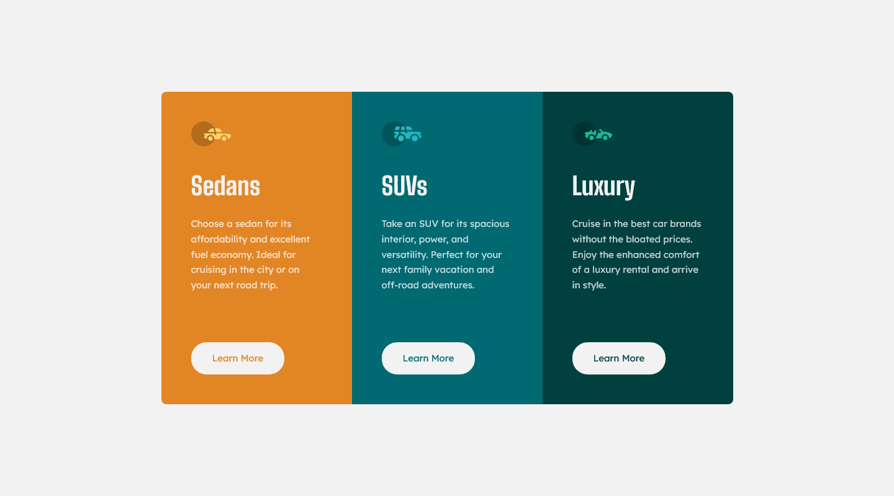

# Frontend Mentor - 3-column preview card component solution

This is a solution to the [3-column preview card component challenge on Frontend Mentor](https://www.frontendmentor.io/challenges/3column-preview-card-component-pH92eAR2-). Frontend Mentor challenges help you improve your coding skills by building realistic projects.

## Table of contents

- [Overview](#overview)
  - [The challenge](#the-challenge)
  - [Screenshot](#screenshot)
  - [Links](#links)
- [My process](#my-process)
  - [Built with](#built-with)
  - [Useful resources](#useful-resources)
- [Author](#author)

**Note: Delete this note and update the table of contents based on what sections you keep.**

## Overview

### The challenge

Users should be able to:

- View the optimal layout depending on their device's screen size
- See hover states for interactive elements

### Screenshot

### Links

- Solution URL: [https://github.com/Arsalan2078/3-column-preview-card-component](https://github.com/Arsalan2078/3-column-preview-card-component)
- Live Site URL: [https://extraordinary-faloodeh-8ac9ec.netlify.app/](https://extraordinary-faloodeh-8ac9ec.netlify.app/)

## My process

### Built with

- Semantic HTML5 markup
- CSS custom properties
- Flexbox
- CSS Grid
- Mobile-first workflow
- [Astro](https://astro.build/) - JS framework

### Useful resources

- [The new CSS reset](https://github.com/elad2412/the-new-css-reset)
- [google webfonts helper](https://gwfh.mranftl.com/fonts)

## Author

- Frontend Mentor - [@Arsalan2078](https://www.frontendmentor.io/profile/Arsalan2078)
